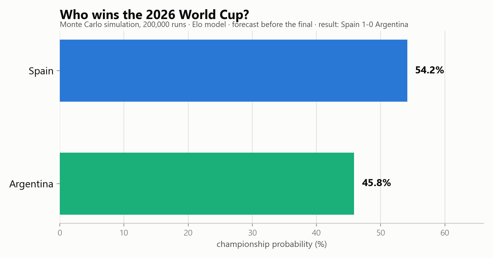
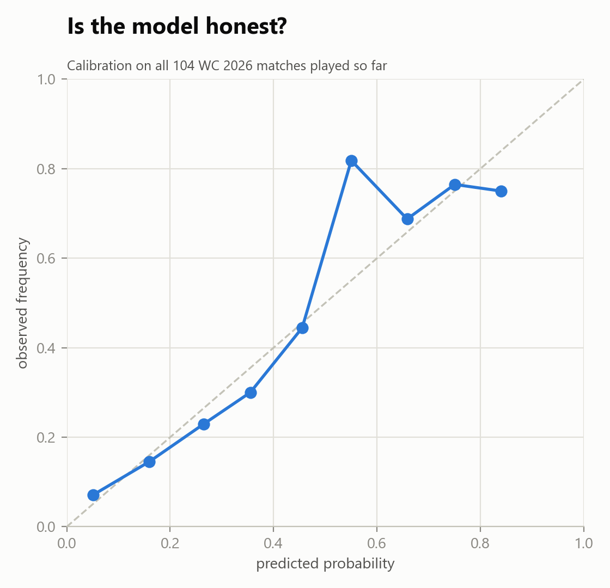
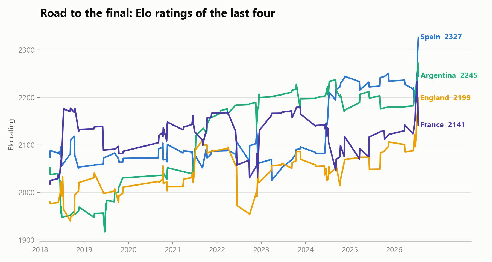

# Can a simple model call the World Cup?

An Elo + Monte Carlo forecast of the 2026 FIFA World Cup, published **before**
each match was played. Predictions are timestamped in
[`outputs/predictions.md`](outputs/predictions.md) and nothing is edited after
the results.

**The model called both the semifinal and the final correctly.**

## Headline prediction (published 19 Jul 2026, before the final)

| Champion | Probability |
|---|---|
| Spain | **54.2%** |
| Argentina | 45.8% |

**Result: Spain 1-0 Argentina** (Ferran Torres, 106', extra time). The
model's top pick won. Going into the final the Elo gap was just 26 points
(Spain 2299, Argentina 2273) after Argentina's comeback win over England
closed a 62/26 pre-semifinal edge into a near coin flip, so the model gave
Argentina a real 45.8% chance. Spain edged it in extra time, as the ratings
narrowly favoured.

## Track record so far

Published 15 Jul 2026, before the second semifinal:

- Semifinal, England vs Argentina: **Argentina 62.4%** to reach the final.
  Result: England 1-2 Argentina. **Correct call.**
- Championship probabilities then: Spain 62.3%, Argentina 26.2%, England 11.5%.



## Method

- **Data:** all 49,509 men's internationals since 1872
  ([martj42/international_results](https://github.com/martj42/international_results), CC0).
- **Ratings:** Elo with tournament-weighted K (World Cup 60 down to friendlies 20),
  goal-margin multiplier, and +80 home advantage on non-neutral grounds,
  following the World Football Elo Ratings convention.
- **Draw model:** instead of assuming a draw rate, it is estimated empirically —
  draw frequency as a function of absolute Elo gap over all matches since 1993,
  interpolated at prediction time (29% for even matches, falling to 12% at a
  400-point gap).
- **Knockouts:** if the 90 minutes is drawn, the tie goes to extra time and
  penalties, where the favourite keeps a dampened edge
  (0.5 + 0.4 × (Elo expectancy − 0.5)).
- **Simulation:** 200,000 Monte Carlo runs of the final, from ratings frozen
  before kickoff (seeded, reproducible).

## Is the model honest? Backtest on this World Cup

Across all 104 matches of the tournament, scored on pre-match ratings only:

- **Accuracy 64.4%** (picking the modal outcome of win/draw/win)
- **Log loss 0.838** vs 1.099 for uniform guessing
- Calibration is close to the diagonal — when the model says 70%, it happens
  roughly 70% of the time:



## Why is it so close?

Spain enter the final with the highest Elo in the world (2299) after beating
Portugal, Belgium and France without conceding more than one goal. But
Argentina's semifinal comeback against England (two headed goals after the
85th minute, both from Messi crosses) was worth a full K=60 World Cup win,
lifting them to 2273. The trajectory chart shows the last four's ratings
since 2018:



## Retro

- Semifinal, England vs Argentina: model gave Argentina 62.4%; Argentina won
  2-1. **Correct.**
- Final, Spain vs Argentina: model gave Spain 54.2%; Spain won 1-0 in extra
  time. **Correct top pick**, though the model rated it close to a coin flip
  and the match bore that out (0-0 through 90 minutes, settled by a 106th
  minute Ferran Torres goal after Enzo Fernandez was sent off).
- What the model could not see: England's bronze-final 6-4 was the highest
  scoring World Cup match since 1982; a team-level Elo model carries no signal
  about a dead-rubber goal fest, and it says nothing about red cards or which
  substitute scores in extra time.

## Limitations

- Team-level ratings only: no lineup, injury, or fatigue information.
- The draw model conditions only on rating gap, not on knockout incentives.
- Elo reacts slowly to golden generations arriving (see England's 2026 spike).

## Run it

```
pip install pandas numpy matplotlib
python wc_sim.py
```
